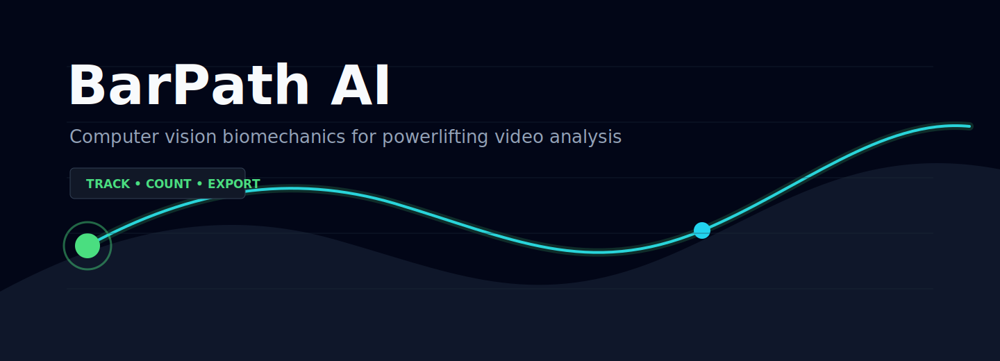

<p align="center">
  
</p>

<h1 align="center">BarPath AI</h1>

<p align="center">
  Computer vision biomechanics analysis for powerlifting and strength training.
</p>

<p align="center">
  
  
  
  
  
</p>

---

## Demo

Drop your lifting clip into the app, choose the lift preset and export a trajectory overlay.

<table>
  <tr>
    <td align="center"><strong>Squat</strong></td>
    <td align="center"><strong>Deadlift</strong></td>
  </tr>
  <tr>
    <td></td>
    <td></td>
  </tr>
</table>

> Bench press support is available through the bench preset and is being tuned for more difficult camera angles.

## What It Does

BarPath AI analyzes squat, bench press and deadlift videos by detecting the barbell frame-by-frame, smoothing its trajectory and rendering an annotated video for review.

- Upload `.mp4`, `.mov`, `.avi` or `.mkv` lifting footage
- Detect and track the barbell across frames
- Draw a high-contrast trajectory overlay
- Count repetitions from vertical bar motion
- Estimate basic bar velocity in pixels per second
- Export an analyzed video from the Streamlit interface
- Swap the baseline OpenCV detector for custom YOLOv8 weights
- Use fast preview mode to validate tracking before a full export

## Pipeline

```text
video upload
    -> frame decoding
    -> barbell detection
       -> OpenCV contour baseline
       -> optional YOLOv8 custom model
    -> centroid smoothing
    -> biomechanical metrics
    -> trajectory renderer
    -> MP4 export
```

The code is split by responsibility so each layer can evolve independently:

```text
app/
  detection/      detector contracts, OpenCV baseline, YOLO adapter
  tracking/       centroid smoothing and path state
  biomechanics/   rep counting, displacement and velocity metrics
  visualization/  overlay rendering
  utils/          config, logging and video helpers
```

## Installation

```bash
git clone https://github.com/jgs/barpath-ai.git
cd barpath-ai
python -m venv .venv
.venv\Scripts\activate
pip install -r requirements.txt
```

On macOS/Linux:

```bash
source .venv/bin/activate
pip install -r requirements.txt
```

## Run

```bash
streamlit run app.py
```

Then open the local Streamlit URL, upload a lifting video and click **Analyze video**.

## YOLOv8 Weights

The default detector is an OpenCV baseline designed for a quick MVP. For higher accuracy, train or fine-tune YOLOv8 on barbell plate annotations and launch the app with the detector set to `yolo`.

Expected class behavior:

- one object around the visible plate or barbell end
- confidence score above the UI threshold
- stable detections across the working set

## Development

```bash
pytest
```

The core contracts are intentionally small:

- `Detector.detect(frame) -> BarbellDetection | None`
- `CentroidTracker.update(detection) -> BarPathTrack`
- `analyze_path(points, frame_index, fps) -> FrameMetrics`
- `draw_analysis_overlay(frame, detection, path, metrics) -> frame`

## Roadmap

- Calibrated velocity in meters per second
- Plate diameter calibration workflow
- Multi-rep set segmentation
- Lift-type presets for squat, bench and deadlift
- Side-view quality scoring
- YOLO training notebook and dataset guide
- CSV export for frame-level metrics
- Coach notes and comparison mode

## License

MIT. See [LICENSE](LICENSE).
